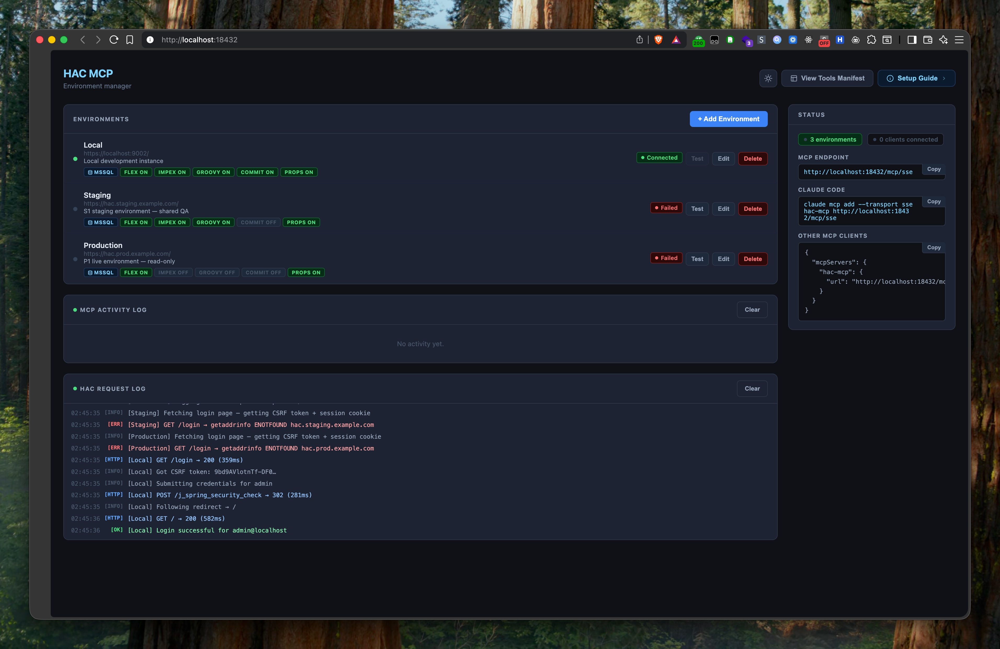

# hac-mcp

A [Model Context Protocol (MCP)](https://modelcontextprotocol.io/) server that provides AI assistants (like Claude) with programmatic access to SAP Commerce Cloud's **Hybris Administration Console (HAC)**. It enables automated FlexibleSearch queries, ImpEx imports, Groovy script execution, and system administration tasks across multiple environments.

It authenticates with HAC using your existing credentials, no backend changes or additional setup required. Permitted operations are configured per environment, so the AI can only do what you explicitly allow.

## What You Can Do

- *"Inspect the PromotionRule with code SUMMER25 in staging and recreate it in my local environment"*
- *"My ImpEx is failing on staging, check the actual values in production and fill in the correct ones"*
- *"Find all orders stuck in WAIT status for more than 3 days in production and give me a summary"*
- *"Write a Groovy script to do ... and run it on local first, if it works I will approve it for staging"*
- *"This code is not working as expected, can you check its edge cases using Groovy with real data on staging?"*
- *"I want to test this CronJob on staging, it has a media field that accepts a CSV in txt format with source-product and target-product columns. Create multiple test medias, write them, run the job for each case, and validate the results with FlexibleSearch"*



## Features

- **Multi-environment support**: configure and switch between local, staging, and production HAC instances
- **Fine-grained permissions**: control which operations are allowed per environment
- **Web UI**: browser-based management console for adding/editing environments and monitoring activity
- **Real-time logging**: live HAC request and MCP tool execution logs via SSE
- **Type search**: trigram-based fuzzy search for SAP Commerce type names with per-environment caching
- **FlexSearch error recovery**: when a query fails due to an unknown field or type, valid field names are fetched and returned alongside the error so the AI can correct and retry without manual intervention
- **ImpEx validation and enrichment**: scripts are pre-validated for missing mandatory fields before import runs, and any post-import attribute errors are resolved to valid field lists on the fly so the AI can fix and retry the script itself

## Tools

| Tool | Description |
|------|-------------|
| `list_environments` | List all configured HAC environments |
| `flexible_search` | Execute FlexibleSearch queries |
| `search_type` | Fuzzy search for type names |
| `get_type_info` | Retrieve type metadata, attributes, and relationships |
| `resolve_pk` | Resolve opaque PKs to type code and unique field values |
| `impex_import` | Execute ImpEx import scripts |
| `groovy_execute` | Execute Groovy scripts |
| `read_property` | Search HAC configuration properties by key/value |
| `media_read` | Read text/plain media content |
| `media_write` | Create or overwrite media models |
| `list_cronjobs` | List CronJobs with optional filtering |
| `run_cronjob` | Execute a CronJob synchronously and wait for completion |

## Installation

### Via npx (recommended)

```bash
npx hac-mcp
```

### Global install

```bash
npm install -g hac-mcp
hac-mcp
```

The server starts on `http://localhost:18432` by default.

```
Options:
  -p, --port    Port to listen on (default: 18432)
  -v, --version Print version
  -h, --help    Show help
```

Environment configuration is stored in `~/.hac-mcp/environments.json`.

### Auto-start on system boot (optional, recommended)

To keep the server running across restarts, use the `startup` subcommand (requires [PM2](https://pm2.keymetrics.io/)):

```bash
npx hac-mcp startup
npx hac-mcp startup --port 4000  # with custom port
```

This registers the server with PM2 and runs `pm2 startup`, which prints a one-time command to run (may require `sudo` on macOS/Linux) to hook PM2 into your OS boot sequence.

## Configuration

### Via Web UI

Open `http://localhost:18432/` in your browser, click **+ Add Environment**, fill in the details (connection is tested automatically as you type), then click **Save**.


### Environment options

| Field | Type | Default | Description |
|-------|------|---------|-------------|
| `name` | string | | Display name |
| `description` | string | | Optional notes |
| `url` | string | | HAC base URL (e.g. `https://host:9002/`) |
| `username` | string | | HAC login username |
| `password` | string | | HAC login password |
| `dbType` | string | `MSSQL` | Database dialect: `MSSQL` or `MySQL` |
| `allowFlexSearch` | boolean | `true` | Allow FlexibleSearch queries |
| `allowImpexImport` | boolean | `false` | Allow ImpEx imports |
| `allowGroovyExecution` | boolean | `false` | Allow Groovy script execution |
| `allowGroovyCommitMode` | boolean | `false` | Allow Groovy scripts to commit changes |
| `allowReadProperty` | boolean | `true` | Allow reading platform config properties |

> **Tip for production:** Disable `allowImpexImport`, `allowGroovyCommitMode`, or both to prevent accidental data modifications.

## Using with Claude

Add the following to your MCP client configuration:

```json
{
  "mcpServers": {
    "hac-mcp": {
      "url": "http://localhost:18432/mcp/sse"
    }
  }
}
```

## Project Structure

```
hac-mcp/
├── server.js           # Express app, MCP SSE endpoint, REST API
├── hac.js              # HAC client (login, FlexSearch, ImpEx, Groovy, etc.)
├── storage.js          # Environment config persistence
├── type-index.js       # Trigram fuzzy type search with caching
├── tools/
│   ├── index.js        # Tool registry
│   ├── context.js      # Shared runtime state (sessions, logging)
│   ├── zodLoose.js     # Loose Zod validators (string -> number/bool)
│   └── *.js            # One file per MCP tool
└── static/
    ├── index.html      # Management console UI
    ├── app.js          # UI logic
    └── style.css       # Styles
```

## Security Notes

- Credentials are stored in plaintext in `~/.hac-mcp/environments.json`. Avoid exposing this file.
- SSL certificate verification is disabled for HAC connections: be aware of this in untrusted networks.
- Restrict write permissions (`allowImpexImport`, `allowGroovyCommitMode`) on production environments.
